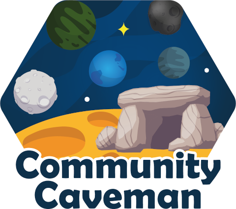

# Description

Shared save game for the [Community Caveman Jool 5 Challenge](https://forum.kerbalspaceprogram.com/index.php?/topic/187070-community-caveman-jool-5-mission/)  
[Link](https://imgur.com/Ojh0FUP.png) to the badge for forum signature 

# Changelog

## [Version 23](https://github.com/maneatingape/community-caveman-jool-5/releases/tag/v23) - 2019-11-19

- Bop and Pol landings successfully completed
- Jeb rendezvoused with VICTOR in Vall orbit

## [Version 22](https://github.com/maneatingape/community-caveman-jool-5/releases/tag/v22) - 2019-11-06

- Tylo landing successfully completed
- Jeb rendezvoused with BRAVO in low Tylo orbit

## [Version 21](https://github.com/maneatingape/community-caveman-jool-5/releases/tag/v21) - 2019-11-04

- VICTOR in elliptic Vall orbit
- KILO in high elliptic Laythe orbit
- LIMA in low Laythe orbit 60x60

## [Version 20](https://github.com/maneatingape/community-caveman-jool-5/releases/tag/v20) - 2019-11-03

- MIKE bumped to "safe" Jool orbit with PE above Tylo's SOI
- MIKE inclination fixed
- TANGO, BRAVO and Jeb rendezvoused in low Tylo orbit

## [Version 19](https://github.com/maneatingape/community-caveman-jool-5/releases/tag/v19) - 2019-10-30

- MIKE to high Jool orbit, re-done to higher elliptical orbit

## [Version 18](https://github.com/maneatingape/community-caveman-jool-5/releases/tag/v18) - 2019-10-14

- MIKE to high Jool orbit

## [Version 17](https://github.com/maneatingape/community-caveman-jool-5/releases/tag/v17) - 2019-10-01

- Dock KILO with MIKE
- Add mission badges

## [Version 16](https://github.com/maneatingape/community-caveman-jool-5/releases/tag/v16) - 2019-09-27

- Dock LIMA with MIKE
- De-orbit debris
- Timewarp to fix SAS glitch
- Contract cleanup to remove markers cluttering map display

## [Version 15](https://github.com/maneatingape/community-caveman-jool-5/releases/tag/v15) - 2019-09-26

- Dock KILOLIMA fuel sections with MIKE

## [Version 14](https://github.com/maneatingape/community-caveman-jool-5/releases/tag/v14) - 2019-09-21

- Dock 7th FOXTROT with MIKE

## [Version 13](https://github.com/maneatingape/community-caveman-jool-5/releases/tag/v13) - 2019-09-18

- Dock 5th and 6th FOXTROT with MIKE
- Update KILOLIMA fuel design

## [Version 12](https://github.com/maneatingape/community-caveman-jool-5/releases/tag/v12) - 2019-09-16

- Dock 3rd TANGO with MIKE
- Dock 4th FOXTROT with MIKE

## [Version 11](https://github.com/maneatingape/community-caveman-jool-5/releases/tag/v11) - 2019-09-15

- Dock 2nd TANGO with MIKE

## [Version 10](https://github.com/maneatingape/community-caveman-jool-5/releases/tag/v10) - 2019-09-14

- Dock 1st TANGO with MIKE
- Dock 3rd FOXTROT with MIKE

## [Version 9](https://github.com/maneatingape/community-caveman-jool-5/releases/tag/v9) - 2019-09-13

- Dock 2nd FOXTROT with MIKE
- Update KILO with lighter version
- Add KILOLIMA fuel package and launcher
- De-orbit some orbital debris

## [Version 8](https://github.com/maneatingape/community-caveman-jool-5/releases/tag/v8) - 2019-09-06

- Tweak MIKE orbit to 80.3km x 80.3km
- Dock 1st FOXTROT with MIKE

## [Version 7](https://github.com/maneatingape/community-caveman-jool-5/releases/tag/v7) - 2019-09-05

- Circularize MIKE orbit to 80km x 80km
- Dock DELTA with MIKE

## [Version 6](https://github.com/maneatingape/community-caveman-jool-5/releases/tag/v6) - 2019-09-04

- Add orbit calculation Python scripts
- Add MIKE craft files (MIKE Booster, MIKE Bottom and MIKE Upper)
- Update save file with MIKE mission to LKO
- Update LIMA craft with docking port, rotated ladder and launch vehicle

## [Version 5](https://github.com/maneatingape/community-caveman-jool-5/releases/tag/v5) - 2019-09-02

- Add Kerbin return vehicle "Kilo"
- Add orbital construction drone "Delta"

## [Version 4](https://github.com/maneatingape/community-caveman-jool-5/releases/tag/v4) - 2019-09-01

- Add Laythe ascent vehicle "Lima"
- Add fuel tender "Foxtrot"
- Configure probe cores to auto-hibernate

## [Version 3](https://github.com/maneatingape/community-caveman-jool-5/releases/tag/v3) - 2019-08-27

- Add 2nd docking port to Tylo lander "Tango"
- Add crew transport vehicle "Charlie"
- Increase all Kerbal experience to 5 stars

## [Version 2](https://github.com/maneatingape/community-caveman-jool-5/releases/tag/v2) - 2019-08-23

- Add Tylo lander "Tango"

## [Version 1](https://github.com/maneatingape/community-caveman-jool-5/releases/tag/v1) - 2019-08-13

- KSP 1.7.3 career mode
- Normal difficulty, CommNet off
- Tech tree unlocked up to and including level 5
- 10,000,000 funds added to savegame
- Welcome VAB and Tracking Station dialogs dismissed